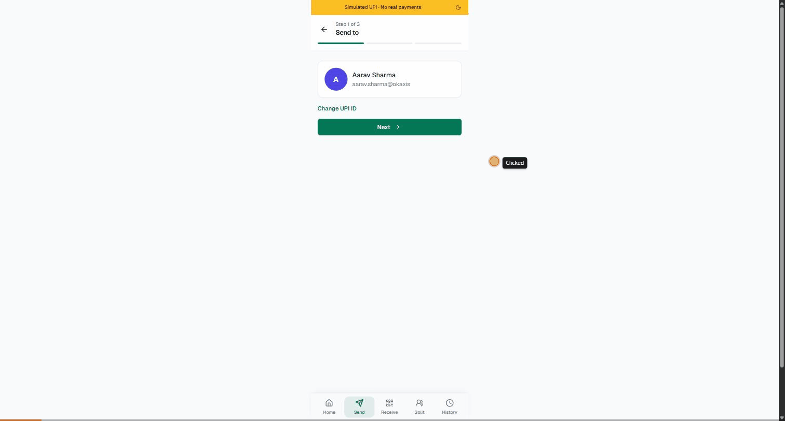
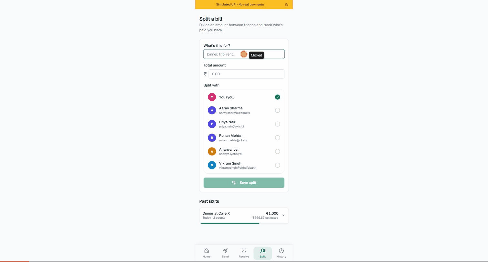

# UPI Split

[](https://github.com/Forstpunk/UPI-Alternate/actions/workflows/ci.yml)
[](./LICENSE)
[](https://nextjs.org/)
[](./CONTRIBUTING.md)

A simulated UPI payments app built with Next.js. It mimics a GPay/PhonePe-style mobile experience — send money, receive via QR, split bills with friends, and browse transaction history — with one twist: any payment over a configurable limit (default ₹1,999) is automatically split into multiple sequential transactions, mirroring per-transaction limits enforced by real UPI apps.

**No real payments are ever made.** Everything is simulated and stored locally in the browser. Installable as a PWA, works fully offline once loaded.

🔗 **Live demo:** https://upi-split-black.vercel.app

## See it in action

| Send a large payment — auto-split, UPI PIN, success | Split a bill between friends and track who's paid |
| --- | --- |
|  |  |

## Features

- **Home** — balance overview with show/hide toggle, quick actions, recent transactions
- **Send** — a 3-step flow (recipient → amount → review & pay) with real-time UPI ID validation and a live preview of how a large payment will be split
- **Split payment engine** — deterministic, paise-accurate splitting logic with an animated per-chunk processing UI (pending → processing → done)
- **UPI PIN confirmation** — a simulated PIN pad gates every payment, matching the confirmation step real UPI apps require
- **Split a bill** — divide an amount equally between contacts, send reminders via the Web Share API (or clipboard), and track who's paid
- **Receive** — generates a scannable UPI deep-link QR code, with an optional amount request that updates the QR live
- **History** — transactions grouped by date, expandable to show the exact chunk breakdown for split payments, exportable as CSV
- **Dark mode** — toggle in the top banner, persisted, no flash of the wrong theme on load
- **Installable PWA** — add it to your home screen and launch it standalone, on desktop or mobile
- **Persistent local state** — balance, contacts, transaction history, and bill splits persist across reloads via `localStorage`

## Tech stack

- [Next.js 14](https://nextjs.org/) (App Router) + TypeScript
- [Tailwind CSS](https://tailwindcss.com/) + [shadcn/ui](https://ui.shadcn.com/) (New York style)
- [Zustand](https://github.com/pmndrs/zustand) for state management, with `persist` middleware
- [React Hook Form](https://react-hook-form.com/) + [Zod](https://zod.dev/) for form validation
- [Framer Motion](https://www.framer.com/motion/) for the payment processing / success animations
- [qrcode.react](https://github.com/zpao/qrcode.react) for QR code generation
- [Vitest](https://vitest.dev/) + [Testing Library](https://testing-library.com/) for unit tests, run in CI via GitHub Actions

## Getting started

```bash
npm install
npm run dev
```

Open [http://localhost:3000](http://localhost:3000) in your browser.

## Testing

```bash
npm test        # run once
npm run test:watch
```

## Project structure

```
app/                  Routes (home, send, receive, split, history)
components/           Shared UI components
components/ui/        shadcn/ui primitives
lib/                  Store, types, formatting, and the split-payment/bill-split engines
```

## Building for production

```bash
npm run build
npm run start
```

## Contributing

Contributions are welcome — see [CONTRIBUTING.md](./CONTRIBUTING.md) for local setup, guidelines, and a checklist to run before opening a PR.

## License

MIT
